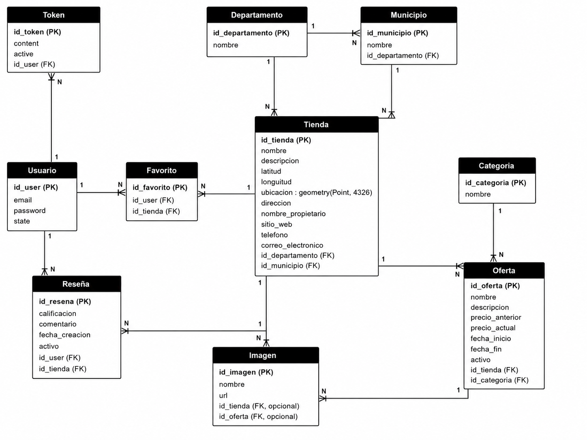

# Base de datos

La base de datos del proyecto utiliza PostgreSQL. En la versión actual se agrega soporte espacial mediante PostGIS para almacenar la ubicación de cada tienda como un punto geográfico.

## Extensiones necesarias

Para crear la base de datos correctamente se deben habilitar las siguientes extensiones:

```sql
CREATE EXTENSION IF NOT EXISTS pgcrypto;
CREATE EXTENSION IF NOT EXISTS postgis;
```

La extensión `pgcrypto` permite generar identificadores UUID con `gen_random_uuid()`. La extensión `postgis` permite utilizar tipos de datos espaciales.

## Tablas principales

| Tabla | Propósito |
|---|---|
| `Usuario` | Almacena los usuarios registrados en el sistema. |
| `Token` | Registra los tokens JWT emitidos y su estado activo o inactivo. |
| `Departamento` | Catálogo de departamentos. |
| `Municipio` | Catálogo de municipios asociados a departamentos. |
| `Categoria` | Catálogo de categorías utilizadas por las ofertas. |
| `Tienda` | Almacena los comercios registrados con su información y ubicación. |
| `Oferta` | Almacena promociones asociadas a tiendas y categorías. |
| `Favorito` | Relación entre usuarios y tiendas marcadas como favoritas. |
| `Imagen` | Guarda metadatos de imágenes asociadas a tiendas u ofertas. |
| `Resena` | Almacena calificaciones y comentarios de usuarios sobre tiendas. |

## Diagrama de base de datos

El modelo de base de datos incluye las relaciones principales entre usuarios, tiendas, ofertas, favoritos, imágenes y reseñas.



## Relaciones principales

| Relación | Descripción |
|---|---|
| `Usuario` → `Token` | Un usuario puede tener varios tokens emitidos. |
| `Usuario` → `Favorito` | Un usuario puede marcar varias tiendas como favoritas. |
| `Usuario` → `Resena` | Un usuario puede escribir reseñas sobre tiendas. |
| `Departamento` → `Municipio` | Un departamento contiene varios municipios. |
| `Departamento` → `Tienda` | Una tienda pertenece a un departamento. |
| `Municipio` → `Tienda` | Una tienda pertenece a un municipio. |
| `Tienda` → `Oferta` | Una tienda puede publicar varias ofertas. |
| `Tienda` → `Imagen` | Una tienda puede tener imágenes asociadas. |
| `Tienda` → `Resena` | Una tienda puede recibir varias reseñas. |
| `Categoria` → `Oferta` | Una categoría clasifica varias ofertas. |
| `Oferta` → `Imagen` | Una oferta puede tener imágenes asociadas. |

## Campo espacial `ubicacion`

La tabla `Tienda` debe incluir un campo espacial llamado `ubicacion`.

```sql
ubicacion GEOMETRY(Point, 4326)
```

Este campo se construye a partir de los valores de longitud y latitud de cada tienda.

```sql
ST_SetSRID(ST_MakePoint(longuitud, latitud), 4326)
```

El SRID `4326` corresponde al sistema de coordenadas WGS 84, utilizado comúnmente para coordenadas GPS.

## Índice espacial

Para mejorar el rendimiento de futuras consultas espaciales, se recomienda crear un índice sobre el campo `ubicacion`.

```sql
CREATE INDEX IF NOT EXISTS idx_tienda_ubicacion
ON Tienda
USING GIST (ubicacion);
```

## Restricciones importantes

- `Usuario.email` debe ser único.
- `Tienda.nombre` debe ser único.
- `Categoria.nombre` debe ser único.
- `Departamento.nombre` debe ser único.
- `Municipio.nombre` debe ser único.
- `Resena` tiene una restricción única sobre `id_user` e `id_tienda`, evitando que un mismo usuario registre más de una reseña sobre la misma tienda.

## Script actualizado

El script completo actualizado se encuentra en:

```text
docs/database/schema-postgis.sql
```
