# Manual de usuario

Este manual describe el uso de las funcionalidades principales de Ahorra YA desde la interfaz web.

## Inicio de sesión

El usuario ingresa con correo y contraseña. También puede iniciar sesión con su cuenta de Google.

{ .screenshot }

## Registro y establecimiento de contraseña

Si el usuario no tiene cuenta, puede completar el registro y establecer una contraseña.

{ .screenshot }

## Pantalla principal del mapa

Después de iniciar sesión, el usuario accede al mapa principal. Desde aquí puede ver tiendas registradas, buscar ubicaciones y abrir el detalle de una tienda.

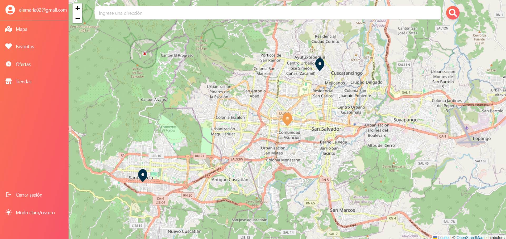{ .screenshot }

## Búsqueda de ubicación

La búsqueda de ubicación permite centrar el mapa en una dirección o zona específica.

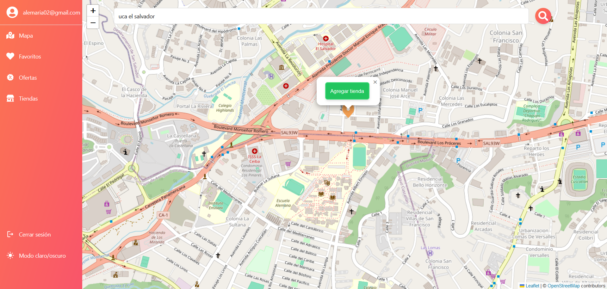{ .screenshot }

## Agregar tienda

Para registrar una tienda, el usuario selecciona la opción de agregar tienda y completa los datos requeridos: nombre, descripción, dirección, departamento, municipio, contacto y coordenadas.

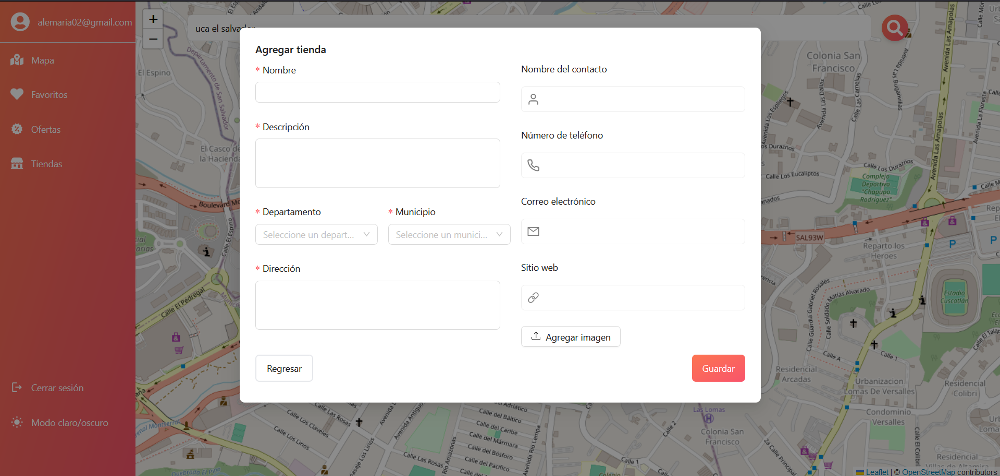{ .screenshot }

## Información de tienda

Al seleccionar una tienda, se abre un panel lateral con información del comercio, dirección, contacto, ofertas disponibles, favoritos y reseñas.

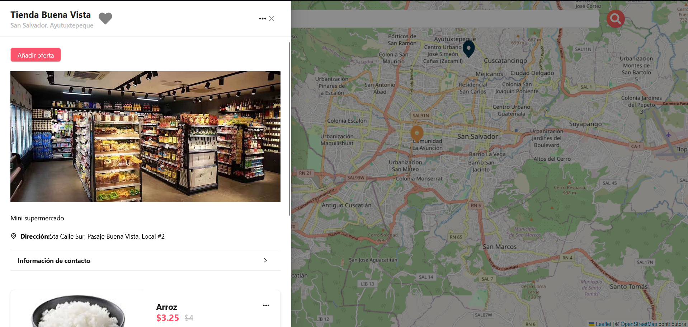{ .screenshot }

## Editar tienda

Desde el menú de opciones de la tienda se puede editar la información del comercio, incluyendo datos de contacto y ubicación.

{ .screenshot }

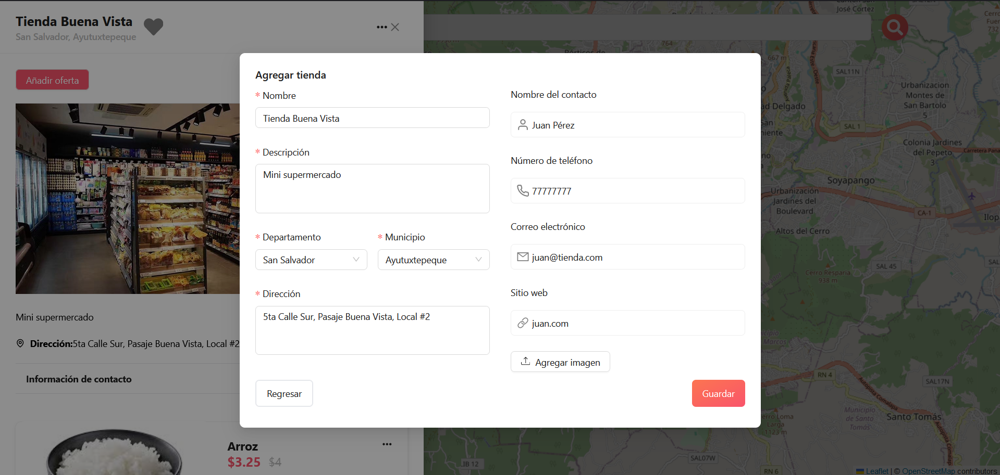{ .screenshot }

## Agregar oferta

Dentro del detalle de una tienda, el usuario puede agregar una oferta indicando nombre, descripción, precio anterior, precio actual, categoría y fechas de vigencia.

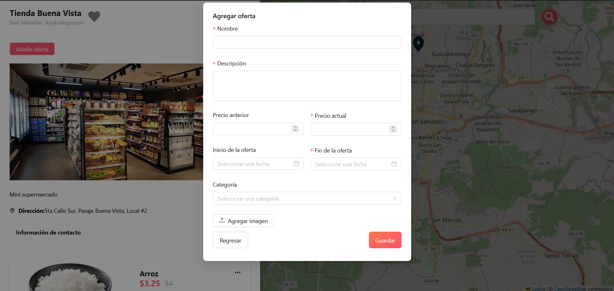{ .screenshot }

## Editar o eliminar oferta

Las ofertas existentes pueden editarse o eliminarse desde el menú de opciones de cada oferta.

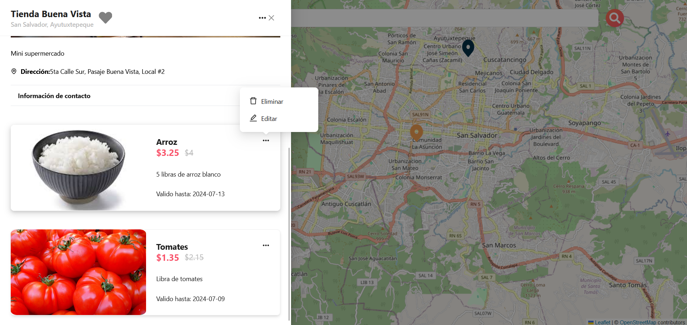{ .screenshot }

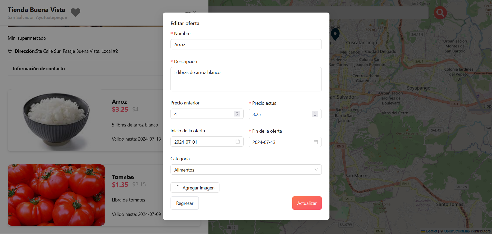{ .screenshot }

## Favoritos

El usuario puede marcar una tienda como favorita utilizando el ícono de corazón en el detalle de la tienda.

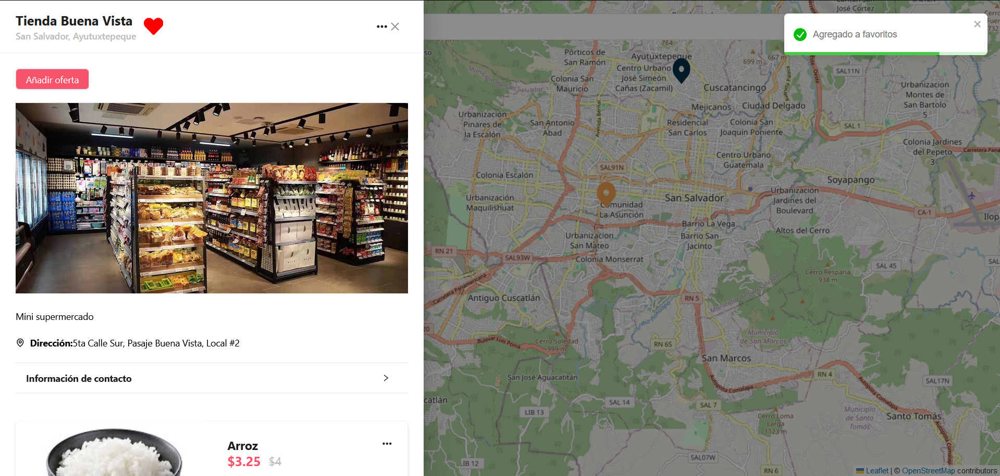{ .screenshot }

El módulo de favoritos muestra las tiendas guardadas por el usuario autenticado.

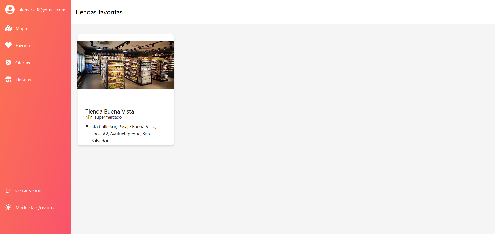{ .screenshot }

## Módulo de ofertas

El módulo de ofertas permite consultar las promociones registradas y buscar ofertas por nombre.

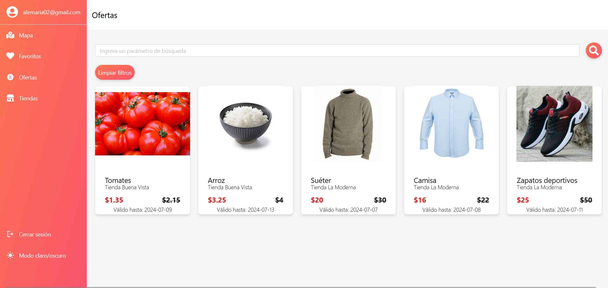{ .screenshot }

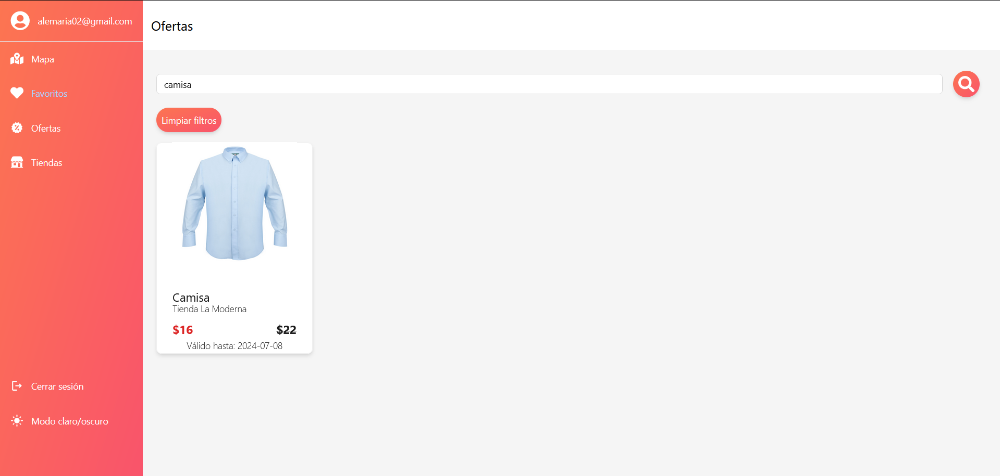{ .screenshot }

## Módulo de tiendas

El módulo de tiendas muestra las tiendas registradas y permite buscar por nombre, departamento o municipio.

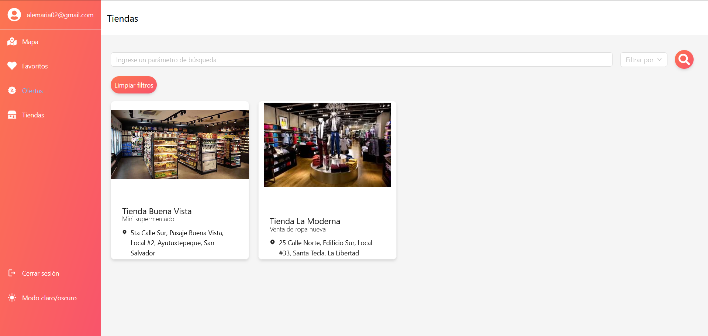{ .screenshot }

{ .screenshot }

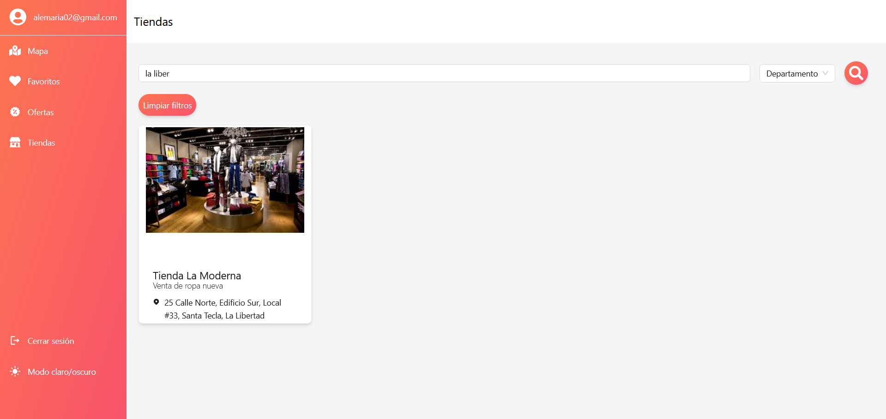{ .screenshot }

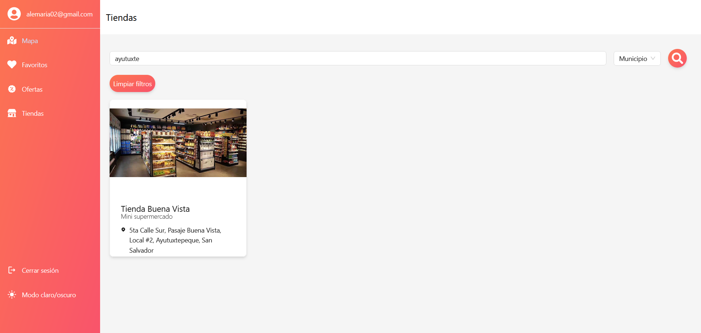{ .screenshot }

## Enrutamiento a tiendas

La plataforma hace un enrutamiento con instrucciones de como llegar a determinado local, en caso el usuario se interese por algun determinado local,se le presentan el camino desde su direccion actual.

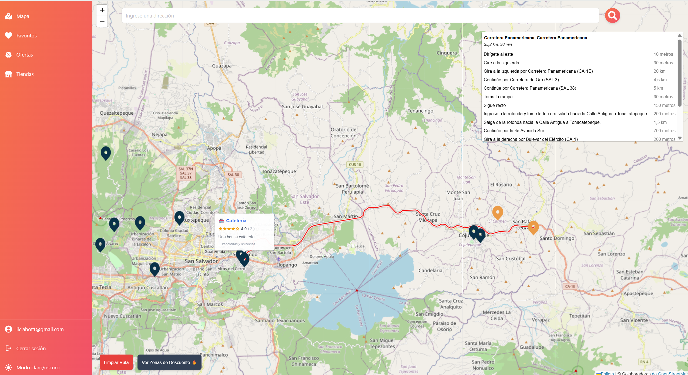{ .screenshot }

## Mapas de calor de ofertas

El usuario puede visualizar mapas de calor de las ofertas activas en una determinada tienda, si la tienda cuenta con ofertas se le mostrara como mapa de calor, al dar click al boton en la parte de abajo a la derecha "Ver Zonas de Descuento".

{ .screenshot }

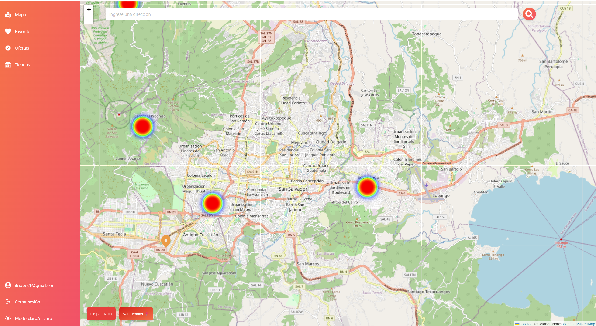{ .screenshot }

## Reseñas y calificaciones

El usuario puede calificar una tienda de 1 a 5 estrellas y escribir un comentario. Cada usuario puede administrar únicamente su propia reseña. El sistema muestra el promedio de calificación y el total de reseñas.

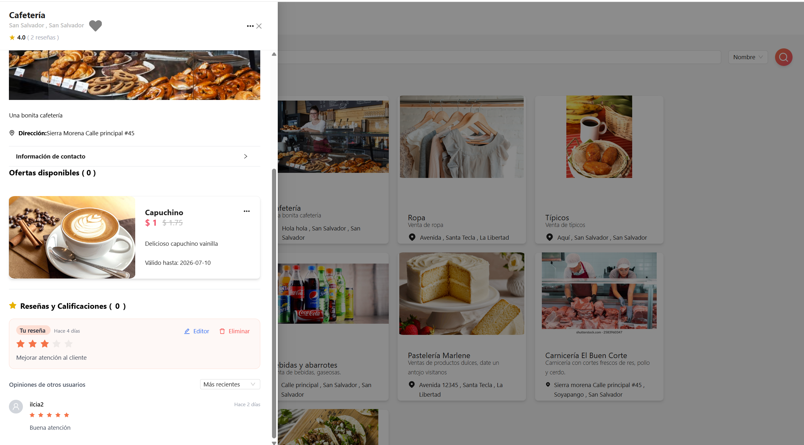{ .screenshot }

## Funciones SIG visibles para el usuario

Desde el mapa el usuario puede:

- Ver tiendas geolocalizadas.
- Usar su ubicación actual.
- Buscar una ubicación.
- Trazar una ruta hacia una tienda.
- Filtrar tiendas u ofertas por cercanía.
- Activar el mapa de calor de zonas de descuento.
